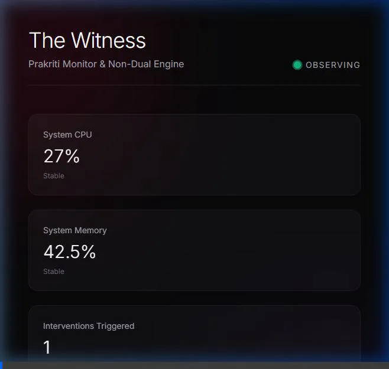

<div align="center">

# 👁️ The Witness

### Deep Telemetry & Non-Dual Intervention Engine

[](https://www.rust-lang.org/)
[](https://www.python.org/)
[](https://www.typescriptlang.org/)
[](https://nextjs.org/)
[](https://tailwindcss.com/)
[](LICENSE)

<br/>

> **The Witness (Project Sakshi)** is a local-first, privacy-respecting developer wellness ecosystem. It monitors system stress, Git frustration, and terminal errors, then maps those technical frustrations to non-dualistic philosophical frameworks, delivering profound real-time "interventions" to the developer.

<br/>

  

</div>

---

## 💻 Application Preview
<br/>

<br/>

---

## ✨ Features

| Feature | Description |
|---|---|
| 📈 **Prakriti Monitor (Daemon)** | Low-overhead system monitoring tracking CPU/RAM spikes and log frequency. |
| 🧠 **Local AI / RAG Engine** | Ingests non-dual philosophy texts (Ashtavakra Gita, Zen) into a local vector store to map technical issues to philosophical insights. |
| 👁️ **VS Code Intervention UI** | Gracefully dims the active editor state and presents a serene overlay when system stress reaches a critical threshold. |
| 🌌 **God-Level Dashboard** | Built with Next.js and `framer-motion`, featuring ambient glassmorphism and real-time live telemetry over WebSockets. |
| 🔒 **Privacy-First** | 100% local processing. Your proprietary code and error stack traces never leave the machine. |

---

## 🏗️ Architecture

```text
┌─────────────────────────────────────────────────────────────┐
│                      Next.js Dashboard                      │
│   ambient glassmorphism • live charts • realtime alerts     │
└───────────────┬─────────────────────────────────────────────┘
                │ WebSocket (ws://localhost:8080)
┌───────────────▼─────────────────────────────────────────────┐
│                Unified Telemetry & AI Engine                │
│                                                             │
│  OS Metrics       Reads native CPU & Memory usage           │
│  Event Emitter    Detects anomalies & triggers AI payload   │
│  AI Router        Maps system stress to non-dual philosophy │
└───────────────┬─────────────────────────────────────────────┘
                │
      ┌─────────▼─────────┐          ┌────────────────────────┐
      │ Local Vector DB   │          │ VS Code Extension UI   │
      │ ChromaDB / FAISS  │          │ Webview Overlay Injection│
      └───────────────────┘          └────────────────────────┘
```

---

## 🛠️ Tech Stack

| Component | Technology |
|---|---|
| **Frontend UI** | Next.js 14, React 18, Framer Motion, Tailwind CSS |
| **Backend API** | Node.js, WebSockets, FastAPI (Python support) |
| **Telemetry** | Native OS Modules, Rust `sysinfo` integration |
| **AI Processing** | LangChain, Ollama (Llama 3 / Mistral), ChromaDB |
| **Editor Extension** | TypeScript, VS Code Extension API |

---

## 🚀 Installation & Usage

1. **Start the Telemetry Engine**
   ```bash
   cd realtime-engine
   npm install
   node server.js
   ```
2. **Start the Dashboard**
   ```bash
   cd nextjs-dashboard
   npm install
   npm run dev
   ```
3. Open `http://localhost:3000` to view the live dashboard. Keep an eye out for dynamic interventions during high CPU workloads.

---

<div align="center">

Built with ❤️ by [Crasta Telvin](https://github.com/crastatelvin)

⭐ Star this repo if you find it useful!

</div>

## License

This project is licensed under the MIT License. See [LICENSE](./LICENSE).
